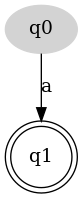
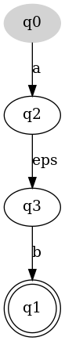
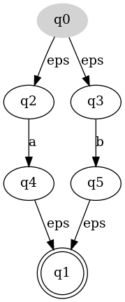
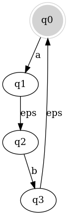
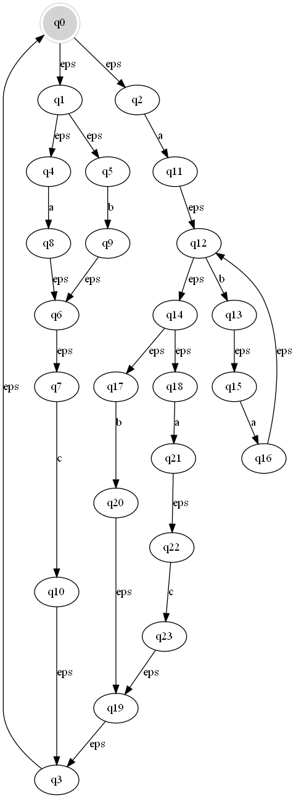
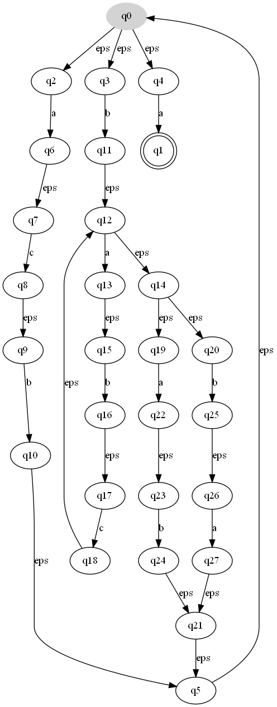
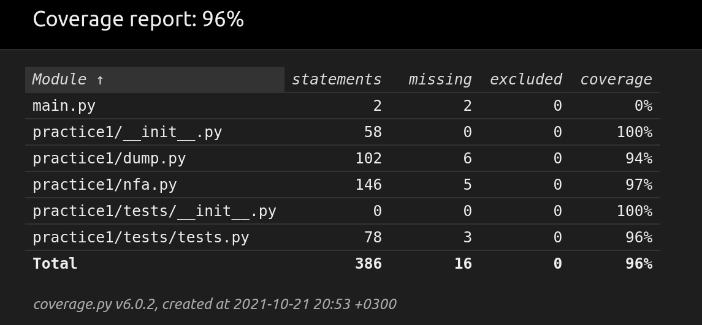

# Задача:

> 13. Даны α и слово u ∈ {a, b, c} ∗ . Найти длину самого длинного подслова u, принадлежащего L.

# Корректность и идея:
> Сначала обозначим корректность и идею:
Построим НКА по данному регулярному выражению, если НКА построить не удалось ввод был не корректен.
Воспользуемся тем, что если НКА может прочитать данное пользователем слово, то оно принадлежит языку,
иначе не принадлежит.

# Подробное описание алгоритма и асимптотика
### асимптотика построения

> 1. Первое на что стоит обратить внимание, что алгоритм буква за буквой разбирает регулярное выражение, 
     каждый раз за O(1), обновляя автомат. Автомат будем представлять себе в виде стека,
     на который кладутся вершины одна за другой, для обновления автомата нам потребуется задействовать
     не более чем 3 вершины из этого стека, что сведется в константу. Но надо учитывать получившееся кол-во вершин и рёбер.

>  Создание простейшего автомата принесло нам 2 состояния и 1 ребро.

>  Операция '.' привнесла 1 ребро по пустому слову. reg_concatination - O(1)

>  Операция '+' привнесла 2 вершины и 4 ребра. reg_or - O(1)

>  Операция '*' привнесла 1 ребро. reg_itration - O(1)

>  Итого если в изначальном выражении было n символов, из них floor(n/2) операций.
   Максимальное кол-во ребер = 2 * n, где n = | reg_expr |.
   Максимальное кол-во вершин = n, где n = | reg_expr |.
   Получили разреженный граф с 2n ребрами, и n вершинами.
### асимптотика обработки

> 2. И так мы построили автомат за O(n), где n = | reg_expr |,
     теперь придется за O(k^2), где k = | input_string | перебрать подстроки,
     входной строки (возможно можно было придумать какое-нибудь ДП P.s. не придумал... ).

>  Для каждой такой строки запустимся по автомату с помощью BFS без пометок в used!!! Это необходимо, т.к.
     в автомате допустимы несколько переходов в разные состояния по одной букве.
     Чтобы прочитать какое-то слово требуется, пройти, как минимум, k состояний, а значит Асимптотика такого BFS
     O(n * k), 2n кол-во ребер иначе говоря ответвлений, значит финальный результат достигается O(n * k^2).
     Но часто, кол-во ответвлений критически мало, а значит сведётся в константу, откуда делаем вывод в оптимальных случаях
     алгоритм работает за перебор подстрок во входном слове O(k^2).

> P.s. За сколько работает dump? Если оценить сверху O(n^2) т.к. для каждой вершины мы рисуем все ребра.


# Решение:
## Шаг 1:
> Т.к. пользователю разрешено передавать поток вывода и ввода, обрабатываем их.
``` python
if isinstance(istream, type(io.StringIO())):
    sys.stdin = istream
if isinstance(ostream, type(io.StringIO())):
    sys.stdout = ostream
```
## Шаг 2:
> Далее считываем из потока строку и парсим по пробелам.
> Если слов меньше чем нужно или больше кидаем исключение.

## Шаг 3:
> Перебираем все подслова переданной строки и проверяем на ответ.

## Шаг 4:
> Начинаем строить автомат.
> Будем парсить по символьно если встречаем символ из алфавита добавляем простейший НКА.



> Рассмотри операцию '.' для букв a, b



> операция '+' для букв a, b



> операция '*' для слова ab



## Шаг 5
> Запускаем BFS по автомату с некоторыми пометками для выхода.
``` python
# Putting the starting state in the queue
index = 0
q = [[self.initial, index]]
while len(q) > 0:
    # Take out the current state
    state = q[0][0]
    ind = q[0][1]
    q.pop(0)
    # Processing eps transitions
    for next_state in _get_ways(state, 'eps'):
        q.append([next_state, ind])
    if ind < len(string):
        # Put in the queue all states reachable by a given letter
        if _is_way_to(state, string[ind]):
            for next_state in _get_ways(state, string[ind]):
                q.append([next_state, ind + 1])
    elif state.final:
        return True
return False
```

## Шаг 6
> Выводим ответ: максимальная длина подстроки

# Тесты из условия 
## Тест 1 "ab+c.aba.*.bac.+.+* babc"
> Ответ: 2

### logs
``` python
2021-10-22 16:02:47,827 - root - INFO - Redirecting input and output streams
2021-10-22 16:02:47,828 - root - INFO - Done...
2021-10-22 16:03:02,139 - root - INFO - Submitted to the entrance: "ab+c.aba.*.bac.+.+*", "babc"
2021-10-22 16:03:02,140 - root - INFO - Start building NFA...
2021-10-22 16:03:02,140 - root - INFO - Constructing NFA from regExpr
2021-10-22 16:03:02,141 - root - INFO - Initialize some basic variables
2021-10-22 16:03:02,141 - root - INFO - Trying to parse regExpr
2021-10-22 16:03:02,141 - root - INFO - Parse regExpr letter by letter
2021-10-22 16:03:02,142 - root - INFO - Creating some basic NFA for one letter
2021-10-22 16:03:02,142 - root - INFO - Created.
2021-10-22 16:03:02,142 - root - INFO - Creating some basic NFA for one letter
2021-10-22 16:03:02,143 - root - INFO - Created.
2021-10-22 16:03:02,144 - root - INFO - Creating some basic NFA for one letter
2021-10-22 16:03:02,144 - root - INFO - Created.
2021-10-22 16:03:02,144 - root - INFO - Creating some basic NFA for one letter
2021-10-22 16:03:02,144 - root - INFO - Created.
2021-10-22 16:03:02,145 - root - INFO - Creating some basic NFA for one letter
2021-10-22 16:03:02,145 - root - INFO - Created.
2021-10-22 16:03:02,145 - root - INFO - Creating some basic NFA for one letter
2021-10-22 16:03:02,145 - root - INFO - Created.
2021-10-22 16:03:02,146 - root - INFO - Creating some basic NFA for one letter
2021-10-22 16:03:02,146 - root - INFO - Created.
2021-10-22 16:03:02,146 - root - INFO - Creating some basic NFA for one letter
2021-10-22 16:03:02,147 - root - INFO - Created.
2021-10-22 16:03:02,147 - root - INFO - Creating some basic NFA for one letter
2021-10-22 16:03:02,147 - root - INFO - Created.
2021-10-22 16:03:02,148 - root - INFO - NFA Constructed.
2021-10-22 16:03:03,461 - root - INFO - Start solving the task.
2021-10-22 16:03:03,461 - root - INFO - ------------------------------------------------
2021-10-22 16:03:03,462 - root - INFO - "b" has been passed to NFA for reading
2021-10-22 16:03:03,462 - root - INFO - the Line wasn't read
2021-10-22 16:03:03,462 - root - INFO - ------------------------------------------------
2021-10-22 16:03:03,462 - root - INFO - "ba" has been passed to NFA for reading
2021-10-22 16:03:03,463 - root - INFO - the Line wasn't read
2021-10-22 16:03:03,463 - root - INFO - ------------------------------------------------
2021-10-22 16:03:03,463 - root - INFO - "bab" has been passed to NFA for reading
2021-10-22 16:03:03,463 - root - INFO - the Line wasn't read
2021-10-22 16:03:03,464 - root - INFO - ------------------------------------------------
2021-10-22 16:03:03,464 - root - INFO - "babc" has been passed to NFA for reading
2021-10-22 16:03:03,464 - root - INFO - the Line wasn't read
2021-10-22 16:03:03,464 - root - INFO - ------------------------------------------------
2021-10-22 16:03:03,465 - root - INFO - "a" has been passed to NFA for reading
2021-10-22 16:03:03,465 - root - INFO - the Line wasn't read
2021-10-22 16:03:03,465 - root - INFO - ------------------------------------------------
2021-10-22 16:03:03,465 - root - INFO - "ab" has been passed to NFA for reading
2021-10-22 16:03:03,466 - root - INFO - the Line was read!
2021-10-22 16:03:03,467 - root - INFO - Checking the length of substring
2021-10-22 16:03:03,467 - root - INFO - New answer!!! 2
2021-10-22 16:03:03,467 - root - INFO - Checked.
2021-10-22 16:03:03,467 - root - INFO - ------------------------------------------------
2021-10-22 16:03:03,468 - root - INFO - "abc" has been passed to NFA for reading
2021-10-22 16:03:03,468 - root - INFO - the Line wasn't read
2021-10-22 16:03:03,468 - root - INFO - ------------------------------------------------
2021-10-22 16:03:03,469 - root - INFO - "b" has been passed to NFA for reading
2021-10-22 16:03:03,469 - root - INFO - the Line wasn't read
2021-10-22 16:03:03,469 - root - INFO - ------------------------------------------------
2021-10-22 16:03:03,469 - root - INFO - "bc" has been passed to NFA for reading
2021-10-22 16:03:03,470 - root - INFO - the Line was read!
2021-10-22 16:03:03,470 - root - INFO - Checking the length of substring
2021-10-22 16:03:03,470 - root - INFO - Checked.
2021-10-22 16:03:03,470 - root - INFO - ------------------------------------------------
2021-10-22 16:03:03,471 - root - INFO - "c" has been passed to NFA for reading
2021-10-22 16:03:03,471 - root - INFO - the Line wasn't read
2021-10-22 16:03:03,471 - root - INFO - Exiting from "solve"
```



## Тест 2 "acb..bab.c.*.ab.ba.+.+*a. abbaa"
> Ответ: 4

### logs
```python
2021-10-22 16:11:47,633 - root - INFO - Redirecting input and output streams
2021-10-22 16:11:47,634 - root - INFO - Done...
2021-10-22 16:11:49,299 - root - INFO - Submitted to the entrance: "acb..bab.c.*.ab.ba.+.+*a.", "abbaa"
2021-10-22 16:11:49,299 - root - INFO - Start building NFA...
2021-10-22 16:11:49,300 - root - INFO - Constructing NFA from regExpr
2021-10-22 16:11:49,300 - root - INFO - Initialize some basic variables
2021-10-22 16:11:49,300 - root - INFO - Trying to parse regExpr
2021-10-22 16:11:49,300 - root - INFO - Parse regExpr letter by letter
2021-10-22 16:11:49,300 - root - INFO - Creating some basic NFA for one letter
2021-10-22 16:11:49,300 - root - INFO - Created.
2021-10-22 16:11:49,300 - root - INFO - Creating some basic NFA for one letter
2021-10-22 16:11:49,306 - root - INFO - Created.
2021-10-22 16:11:49,306 - root - INFO - Creating some basic NFA for one letter
2021-10-22 16:11:49,306 - root - INFO - Created.
2021-10-22 16:11:49,306 - root - INFO - Creating some basic NFA for one letter
2021-10-22 16:11:49,306 - root - INFO - Created.
2021-10-22 16:11:49,306 - root - INFO - Creating some basic NFA for one letter
2021-10-22 16:11:49,307 - root - INFO - Created.
2021-10-22 16:11:49,307 - root - INFO - Creating some basic NFA for one letter
2021-10-22 16:11:49,307 - root - INFO - Created.
2021-10-22 16:11:49,307 - root - INFO - Creating some basic NFA for one letter
2021-10-22 16:11:49,307 - root - INFO - Created.
2021-10-22 16:11:49,307 - root - INFO - Creating some basic NFA for one letter
2021-10-22 16:11:49,307 - root - INFO - Created.
2021-10-22 16:11:49,307 - root - INFO - Creating some basic NFA for one letter
2021-10-22 16:11:49,308 - root - INFO - Created.
2021-10-22 16:11:49,308 - root - INFO - Creating some basic NFA for one letter
2021-10-22 16:11:49,308 - root - INFO - Created.
2021-10-22 16:11:49,308 - root - INFO - Creating some basic NFA for one letter
2021-10-22 16:11:49,308 - root - INFO - Created.
2021-10-22 16:11:49,308 - root - INFO - Creating some basic NFA for one letter
2021-10-22 16:11:49,308 - root - INFO - Created.
2021-10-22 16:11:49,308 - root - INFO - NFA Constructed.
2021-10-22 16:11:49,407 - root - INFO - Start solving the task.
2021-10-22 16:11:49,407 - root - INFO - ------------------------------------------------
2021-10-22 16:11:49,407 - root - INFO - "a" has been passed to NFA for reading
2021-10-22 16:11:49,407 - root - INFO - the Line was read!
2021-10-22 16:11:49,407 - root - INFO - Checking the length of substring
2021-10-22 16:11:49,407 - root - INFO - New answer!!! 1
2021-10-22 16:11:49,407 - root - INFO - Checked.
2021-10-22 16:11:49,407 - root - INFO - ------------------------------------------------
2021-10-22 16:11:49,407 - root - INFO - "ab" has been passed to NFA for reading
2021-10-22 16:11:49,407 - root - INFO - the Line wasn't read
2021-10-22 16:11:49,407 - root - INFO - ------------------------------------------------
2021-10-22 16:11:49,408 - root - INFO - "abb" has been passed to NFA for reading
2021-10-22 16:11:49,408 - root - INFO - the Line wasn't read
2021-10-22 16:11:49,408 - root - INFO - ------------------------------------------------
2021-10-22 16:11:49,408 - root - INFO - "abba" has been passed to NFA for reading
2021-10-22 16:11:49,408 - root - INFO - the Line wasn't read
2021-10-22 16:11:49,408 - root - INFO - ------------------------------------------------
2021-10-22 16:11:49,408 - root - INFO - "abbaa" has been passed to NFA for reading
2021-10-22 16:11:49,408 - root - INFO - the Line wasn't read
2021-10-22 16:11:49,408 - root - INFO - ------------------------------------------------
2021-10-22 16:11:49,408 - root - INFO - "b" has been passed to NFA for reading
2021-10-22 16:11:49,408 - root - INFO - the Line wasn't read
2021-10-22 16:11:49,408 - root - INFO - ------------------------------------------------
2021-10-22 16:11:49,408 - root - INFO - "bb" has been passed to NFA for reading
2021-10-22 16:11:49,408 - root - INFO - the Line wasn't read
2021-10-22 16:11:49,408 - root - INFO - ------------------------------------------------
2021-10-22 16:11:49,408 - root - INFO - "bba" has been passed to NFA for reading
2021-10-22 16:11:49,408 - root - INFO - the Line wasn't read
2021-10-22 16:11:49,409 - root - INFO - ------------------------------------------------
2021-10-22 16:11:49,409 - root - INFO - "bbaa" has been passed to NFA for reading
2021-10-22 16:11:49,409 - root - INFO - the Line was read!
2021-10-22 16:11:49,409 - root - INFO - Checking the length of substring
2021-10-22 16:11:49,409 - root - INFO - New answer!!! 4
2021-10-22 16:11:49,409 - root - INFO - Checked.
2021-10-22 16:11:49,409 - root - INFO - ------------------------------------------------
2021-10-22 16:11:49,409 - root - INFO - "b" has been passed to NFA for reading
2021-10-22 16:11:49,409 - root - INFO - the Line wasn't read
2021-10-22 16:11:49,409 - root - INFO - ------------------------------------------------
2021-10-22 16:11:49,409 - root - INFO - "ba" has been passed to NFA for reading
2021-10-22 16:11:49,409 - root - INFO - the Line wasn't read
2021-10-22 16:11:49,409 - root - INFO - ------------------------------------------------
2021-10-22 16:11:49,409 - root - INFO - "baa" has been passed to NFA for reading
2021-10-22 16:11:49,409 - root - INFO - the Line wasn't read
2021-10-22 16:11:49,409 - root - INFO - ------------------------------------------------
2021-10-22 16:11:49,409 - root - INFO - "a" has been passed to NFA for reading
2021-10-22 16:11:49,409 - root - INFO - the Line was read!
2021-10-22 16:11:49,409 - root - INFO - Checking the length of substring
2021-10-22 16:11:49,409 - root - INFO - Checked.
2021-10-22 16:11:49,410 - root - INFO - ------------------------------------------------
2021-10-22 16:11:49,410 - root - INFO - "aa" has been passed to NFA for reading
2021-10-22 16:11:49,410 - root - INFO - the Line wasn't read
2021-10-22 16:11:49,410 - root - INFO - ------------------------------------------------
2021-10-22 16:11:49,410 - root - INFO - "a" has been passed to NFA for reading
2021-10-22 16:11:49,410 - root - INFO - the Line was read!
2021-10-22 16:11:49,410 - root - INFO - Checking the length of substring
2021-10-22 16:11:49,410 - root - INFO - Checked.
2021-10-22 16:11:49,410 - root - INFO - Exiting from "solve"
```


## Результаты тестирования



# Документация
# Summary

 Members                        | Descriptions                                
--------------------------------|---------------------------------------------
`namespace `[`practice1`](#namespacepractice1) | Python Library - Solve for homework: 'Formal Languages, Practice 1, task 13'.
`namespace `[`practice1::dump`](#namespacepractice1_1_1dump) | module - Dump utility of NFA.
`namespace `[`practice1::nfa`](#namespacepractice1_1_1nfa) | module - Implementation of [NFA](#classpractice1_1_1nfa_1_1NFA).

# namespace `practice1` 

Python Library - Solve for homework: 'Formal Languages, Practice 1, task 13'.

## Summary

 Members                        | Descriptions                                
--------------------------------|---------------------------------------------
`public def `[`solve`](#namespacepractice1_1a4f1e2327621575169836b24fad1c4cc0)`(istream,ostream)`            | Solution for the task.

## Members

#### `public def `[`solve`](#namespacepractice1_1a4f1e2327621575169836b24fad1c4cc0)`(istream,ostream)` 

Solution for the task.

Корректность: воспользуемся тем, что любая регулярка задаёт НКА. А значит если подслово может быть прочитано НКА, то оно принадлежит установленному языку. Более точно, переберем все подстроки данной нам строки и попытаемся их прочитать, длина наибольшей прочитанной строки будет ответом. Верность построения НКА доказывается самим алгоритмом построения.

# namespace `practice1::dump` 

module - Dump utility of NFA.

## Summary

 Members                        | Descriptions                                
--------------------------------|---------------------------------------------
`public def `[`__dump__`](#namespacepractice1_1_1dump_1ad9f715f29da831aa7643c91af5ebe458)`(nfa,filename)`            | Dump the information about NFA.
`private def `[`__get_transitions_count`](#namespacepractice1_1_1dump_1a48a26379315f5034651c9f7bb9bb4fe5)`(node)`            | Counts the number of possible transitions.
`public def `[`__print__`](#namespacepractice1_1_1dump_1ab26a8f699adf1b51bbb17f5d6b0f5286)`(nfa)`            | Dump NFA.
`public def `[`__print_brief__`](#namespacepractice1_1_1dump_1ae6922a078c8fb18193cfe597b9590312)`(node)`            | Print a summary of the NFA node.
`public def `[`__print_node__`](#namespacepractice1_1_1dump_1ade4c74aabe15dae245a2b47484ca9612)`(node)`            | Printing node of NFA.
`private def `[`_tree_remove`](#namespacepractice1_1_1dump_1a99dcf84e0b8fa8cb8f8c888ffc8f198f)`(str top)`            | Removes all files in the current directory.
`public str `[`make_new_state`](#namespacepractice1_1_1dump_1a8d3277da1b00286352f693cdb9c011a0)`(node)`            | Generate new name for id(node) in format: f'q + {id}'.

## Members

#### `public def `[`__dump__`](#namespacepractice1_1_1dump_1ad9f715f29da831aa7643c91af5ebe458)`(nfa,filename)` 

Dump the information about NFA.

#### Parameters
* `nfa` NFA 

* `filename` output file

#### `private def `[`__get_transitions_count`](#namespacepractice1_1_1dump_1a48a26379315f5034651c9f7bb9bb4fe5)`(node)` 

Counts the number of possible transitions.

#### Parameters
* `node` node that number of transitions is being searched for 

#### Returns
count: number of transitions

#### `public def `[`__print__`](#namespacepractice1_1_1dump_1ab26a8f699adf1b51bbb17f5d6b0f5286)`(nfa)` 

Dump NFA.

Make notes about nodes and their connections 
#### Parameters
* `nfa` nondeterministic finite automaton that need to be print

#### `public def `[`__print_brief__`](#namespacepractice1_1_1dump_1ae6922a078c8fb18193cfe597b9590312)`(node)` 

Print a summary of the NFA node.

Short output format: 'node.name node.final' 
#### Parameters
* `node` node the debug information about which should be output

#### `public def `[`__print_node__`](#namespacepractice1_1_1dump_1ade4c74aabe15dae245a2b47484ca9612)`(node)` 

Printing node of NFA.

Output the name of the node, its final and a list of neighbors with their number 
#### Parameters
* `node` printing node

#### `private def `[`_tree_remove`](#namespacepractice1_1_1dump_1a99dcf84e0b8fa8cb8f8c888ffc8f198f)`(str top)` 

Removes all files in the current directory.

#### Parameters
* `top` Name of initial directory.

#### `public str `[`make_new_state`](#namespacepractice1_1_1dump_1a8d3277da1b00286352f693cdb9c011a0)`(node)` 

Generate new name for id(node) in format: f'q + {id}'.

#### Parameters
* `node` node 

#### Returns
name: new name of node

# namespace `practice1::nfa` 

module - Implementation of [NFA](#classpractice1_1_1nfa_1_1NFA).

## Summary

 Members                        | Descriptions                                
--------------------------------|---------------------------------------------
`private list `[`_get_ways`](#namespacepractice1_1_1nfa_1a4d9a2e5db8da6340541e17cde0bc5680)`(`[`_Node`](#classpractice1_1_1nfa_1_1__Node)` state,str letter)`            | Returns a list of states that can be entered by a given letter.
`private bool `[`_is_letter`](#namespacepractice1_1_1nfa_1a12e43040f4837c23c481fc929939fed5)`(str symbol)`            | Checks for the presence of a character in the alphabet.
`private bool `[`_is_way_to`](#namespacepractice1_1_1nfa_1a44b82383fce3d09db5a6b4ee9e553c6b)`(`[`_Node`](#classpractice1_1_1nfa_1_1__Node)` state,str letter)`            | Checks for the presence letter in possible transitions.
`class `[`practice1::nfa::_CreateNFA`](#classpractice1_1_1nfa_1_1__CreateNFA) | Functor for creating [NFA](#classpractice1_1_1nfa_1_1NFA).
`class `[`practice1::nfa::_Node`](#classpractice1_1_1nfa_1_1__Node) | Section: Working with states of [NFA](#classpractice1_1_1nfa_1_1NFA).
`class `[`practice1::nfa::NFA`](#classpractice1_1_1nfa_1_1NFA) | Section: Working with [NFA](#classpractice1_1_1nfa_1_1NFA).

## Members

#### `private list `[`_get_ways`](#namespacepractice1_1_1nfa_1a4d9a2e5db8da6340541e17cde0bc5680)`(`[`_Node`](#classpractice1_1_1nfa_1_1__Node)` state,str letter)` 

Returns a list of states that can be entered by a given letter.

#### Parameters
* `state` state of [NFA](#classpractice1_1_1nfa_1_1NFA)

* `letter` letter from preset alphabet 

#### Returns
list list of states that can be entered by a given letter

#### `private bool `[`_is_letter`](#namespacepractice1_1_1nfa_1a12e43040f4837c23c481fc929939fed5)`(str symbol)` 

Checks for the presence of a character in the alphabet.

#### Parameters
* `symbol` user-supplied character 

#### Returns
True if symbol in alphabet 

#### Returns
False if symbol not in alphabet

#### `private bool `[`_is_way_to`](#namespacepractice1_1_1nfa_1a44b82383fce3d09db5a6b4ee9e553c6b)`(`[`_Node`](#classpractice1_1_1nfa_1_1__Node)` state,str letter)` 

Checks for the presence letter in possible transitions.

#### Parameters
* `state` state of [NFA](#classpractice1_1_1nfa_1_1NFA)

* `letter` letter from preset alphabet 

#### Returns
True if ways exist 

#### Returns
False if ways don't exist

# class `practice1::nfa::_CreateNFA` 

Functor for creating [NFA](#classpractice1_1_1nfa_1_1NFA).

## Summary

 Members                        | Descriptions                                
--------------------------------|---------------------------------------------
`public  `[`nodes`](#classpractice1_1_1nfa_1_1__CreateNFA_1a6da5270e48c8b5c2f0dbaa008af4df76) | 
`public  `[`stack`](#classpractice1_1_1nfa_1_1__CreateNFA_1a37d7c639a3adefa88200027e9f78ba3f) | 
`public def `[`__init__`](#classpractice1_1_1nfa_1_1__CreateNFA_1a62d114c8017936187a4b318c581e0bb3)`(self,reg_exp)` | Constructing [NFA](#classpractice1_1_1nfa_1_1NFA) instance.
`public def `[`reg_concatenation`](#classpractice1_1_1nfa_1_1__CreateNFA_1a5c3712c31bdf8318bd4b732d4e99014b)`(self)` | Regex concatenation This method takes the last two elements in stack and concatenates.
`public def `[`reg_iteration`](#classpractice1_1_1nfa_1_1__CreateNFA_1a377c78827ef6e6c6bfa1e88c880b6882)`(self)` | Regex iteration This method takes the last element and applies the Kleene star.
`public def `[`reg_or`](#classpractice1_1_1nfa_1_1__CreateNFA_1a57eb512c08bd3207c3a41667f054dc65)`(self)` | boolean 'or' for regular expressions This method takes the last two elements in stack and forks them into one block with the help of two additional states.

## Members

#### `public  `[`nodes`](#classpractice1_1_1nfa_1_1__CreateNFA_1a6da5270e48c8b5c2f0dbaa008af4df76) 

#### `public  `[`stack`](#classpractice1_1_1nfa_1_1__CreateNFA_1a37d7c639a3adefa88200027e9f78ba3f) 

#### `public def `[`__init__`](#classpractice1_1_1nfa_1_1__CreateNFA_1a62d114c8017936187a4b318c581e0bb3)`(self,reg_exp)` 

Constructing [NFA](#classpractice1_1_1nfa_1_1NFA) instance.

#### `public def `[`reg_concatenation`](#classpractice1_1_1nfa_1_1__CreateNFA_1a5c3712c31bdf8318bd4b732d4e99014b)`(self)` 

Regex concatenation This method takes the last two elements in stack and concatenates.

#### `public def `[`reg_iteration`](#classpractice1_1_1nfa_1_1__CreateNFA_1a377c78827ef6e6c6bfa1e88c880b6882)`(self)` 

Regex iteration This method takes the last element and applies the Kleene star.

#### `public def `[`reg_or`](#classpractice1_1_1nfa_1_1__CreateNFA_1a57eb512c08bd3207c3a41667f054dc65)`(self)` 

boolean 'or' for regular expressions This method takes the last two elements in stack and forks them into one block with the help of two additional states.

# class `practice1::nfa::_Node` 

Section: Working with states of [NFA](#classpractice1_1_1nfa_1_1NFA).

Node - state of NKA

## Summary

 Members                        | Descriptions                                
--------------------------------|---------------------------------------------
`public  `[`final`](#classpractice1_1_1nfa_1_1__Node_1a46a85338742bf5c446ee7a462d658889) | 
`public def `[`__init__`](#classpractice1_1_1nfa_1_1__Node_1ae8d7d57832bfb87f45bdc9b6e8bfc030)`(self,`[`transitions`](#classpractice1_1_1nfa_1_1__Node_1a2594171e7c2a90ab61e43e1bc68adaf7)`,`[`final`](#classpractice1_1_1nfa_1_1__Node_1af28a838c358ed1f4ae4ebd0b702ea078)`)` | 

## Members

#### `public  `[`final`](#classpractice1_1_1nfa_1_1__Node_1a46a85338742bf5c446ee7a462d658889) 

#### `public def `[`__init__`](#classpractice1_1_1nfa_1_1__Node_1ae8d7d57832bfb87f45bdc9b6e8bfc030)`(self,`[`transitions`](#classpractice1_1_1nfa_1_1__Node_1a2594171e7c2a90ab61e43e1bc68adaf7)`,`[`final`](#classpractice1_1_1nfa_1_1__Node_1af28a838c358ed1f4ae4ebd0b702ea078)`)` 

# class `practice1::nfa::NFA` 

Section: Working with [NFA](#classpractice1_1_1nfa_1_1NFA).

Nondeterministic finite automaton It consists of a list of states, in which, inside each state, all possible transitions to other states are stored, allowed by a regular expression specified by the user in reverse Polish notation.

## Summary

 Members                        | Descriptions                                
--------------------------------|---------------------------------------------
`public  `[`nodes`](#classpractice1_1_1nfa_1_1NFA_1a6da5270e48c8b5c2f0dbaa008af4df76) | 
`public  `[`state`](#classpractice1_1_1nfa_1_1NFA_1adc6e5733fc3c22f0a7b2914188c49c90) | 
`public def `[`__init__`](#classpractice1_1_1nfa_1_1NFA_1a1be0698cef9313432d31dd5028cd7654)`(self,str reg_exp)` | Initialize method from a regExp in reverse Polish notation.
`public bool `[`read`](#classpractice1_1_1nfa_1_1NFA_1a42f933055dd9fadc2a95f6f3484dc096)`(self,str string)` | Answers the question whether the string can be read by the [NFA](#classpractice1_1_1nfa_1_1NFA) This method uses the breadth-first search algorithm.

## Members

#### `public  `[`nodes`](#classpractice1_1_1nfa_1_1NFA_1a6da5270e48c8b5c2f0dbaa008af4df76) 

#### `public  `[`state`](#classpractice1_1_1nfa_1_1NFA_1adc6e5733fc3c22f0a7b2914188c49c90) 

#### `public def `[`__init__`](#classpractice1_1_1nfa_1_1NFA_1a1be0698cef9313432d31dd5028cd7654)`(self,str reg_exp)` 

Initialize method from a regExp in reverse Polish notation.

#### Parameters
* `reg_exp` regular expression given in reverse Polish notation

#### `public bool `[`read`](#classpractice1_1_1nfa_1_1NFA_1a42f933055dd9fadc2a95f6f3484dc096)`(self,str string)` 

Answers the question whether the string can be read by the [NFA](#classpractice1_1_1nfa_1_1NFA) This method uses the breadth-first search algorithm.

#### Parameters
* `string` the string passed by the user 

#### Returns
True if the string can be read by an automaton 

#### Returns
False if the string can't be read by an automaton

Generated by [Moxygen](https://sourcey.com/moxygen)
